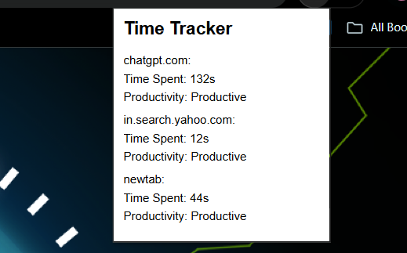

# CHROME-EXTENSION-FOR-TIME-TRACKING-AND-PRODUCTIVITY-ANALYTICS
# ⏱️ Time Tracker Chrome Extension

A Chrome extension that tracks time spent on different websites and provides productivity analytics. It helps users monitor their online behavior, classify websites as productive or unproductive, and view weekly reports.
---
## 👨‍💻 Internship Details
- **Intern Name**: Obulesu Polisetti
- **Intern ID**: CT08DG2167  
- **Internship Program**: Full Stack Web Development Internship  
- **Organization**: [CODTECH Technologies](https://codtech.in)  
- **Task Number**: Task-3 – REAL-TIME COLLABORATIVE DOCUMENT EDITOR  
- **Project Title**:  CHROME-EXTENSION-FOR-TIME-TRACKING-AND-PRODUCTIVITY-ANALYTICS
- **Duration**: 17 June 2025 – 17 August 2025 
---


## 🔧 Features

- ⏳ Tracks time spent on each website
- 📊 Provides productivity analytics via a dashboard
- 🚫 Differentiates between productive (e.g., coding) and unproductive (e.g., social media) sites
- 📅 Weekly summary reports
- 💾 Data stored using backend (Node.js + MongoDB)

---

## 📸 Preview



---

## 🧩 Installation (Local Development)

1. **Clone the Repository**

```bash
git clone https://github.com/YOUR_USERNAME/time-tracker-extension.git
cd time-tracker-extension
